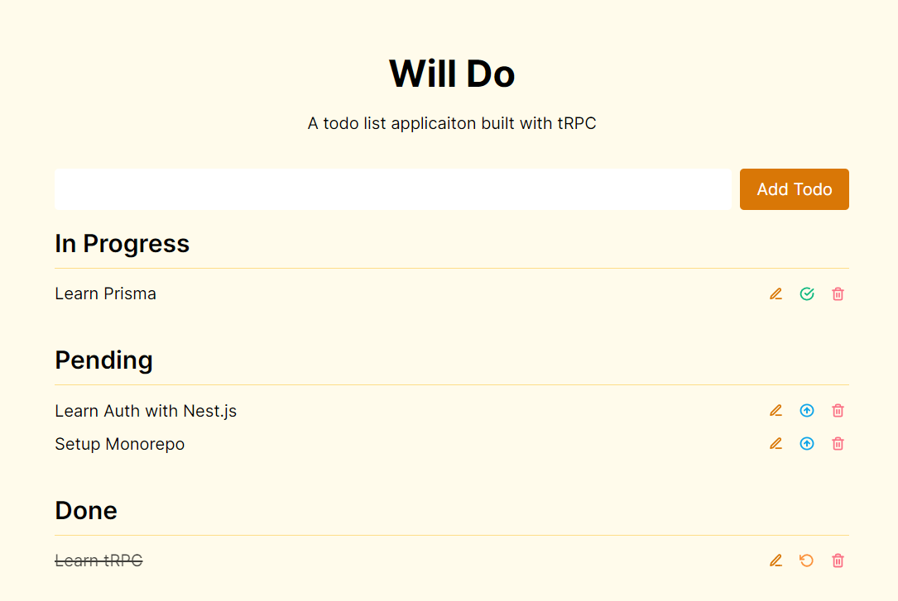

# Will do

Todo list application built with tRPC and MongoDB

### Development Setup

-   Install dependencies

```sh
yarn
```

-   Start dev server

```sh
yarn dev
```

Bootstrapped with [create-next-project](https://github.com/PiyushPawar17/create-next-project)

#### Screenshot


